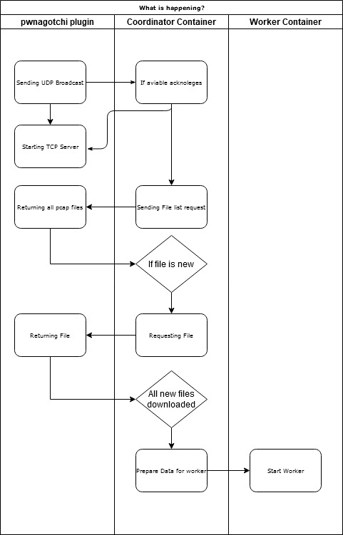

# Docker coordinator

The aim of this tool is to communicate with your pwnagotchi and coordinate the attack runs. It initiates a connection to the pwnagotchi Plugin and downloads the files. After this it shedules workloads to pass to the worker script at time.

## Overwiew

